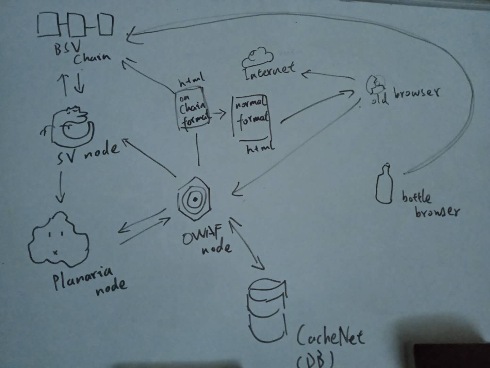

# MetaNet 时代的 Web 应用架构

在 Metanet 架构中, 有以下几个关键部分:

1. BSV 节点程序

BSV 节点程序是和 BSV BlockChain 直接连通的部分. 负责处理与其它节点的连接, 以及交易内容的验证. 虽然也可以我们自己实现一个符合 Bitcoin P2P consensus 的节点, 但考虑到这部分功能的难度以及重要程度, 不建议自行实现. 推荐使用 nChain 公司维护和开发的 BitcoinSV 节点程序.

2. 区块链数据解析和查询节点

区块链上存储的数据种类繁多, 而且是未经过索引的, 查询起来十分困难. 所以需要一个能够解析和搜寻数据的数据库.

Planaria 的前身是 BitDB, 是由 unwriter 开发的, 内置 MongoDB, 以及查询语法 BitQuery. 这部分工具已经应用于多个实际项目, 例如 "https://bitstagram.bitdb.network/" , "https://weathersv.app/find"

这部分工作并不是很难, 可以自行用其它的数据库实现.

3. 反应节点

反应节点是根据外部的消息(包括区块链上的最新交易状态, 以及普通的 http 消息)来做出反应的节点. 可以用任意的编程语言来编写.

这工作由于需要对交易进行签名, 所以要实现钱包的部分功能(私钥管理, 交易构造, 交易签名).

反应节点会将构造好的交易直接通过 BSV 节点来广播.(目前也有很多区块浏览器提供了这种服务).

4. 传统数据库(CacheNet)

由于 MetaNet 目前的存储价格依然偏高, 特别是对于要经常修改的数据来说, 存储在传统的数据库中, 是更合理的选择.

所以这里我们使用了 CacheNet, 它能够模拟 MetaNet 的读写方式(读写分离), 便于逐步切换到 MetaNet.

5. 浏览器端

Web 应用不得不提浏览器端, 在 unwriter 的 bottle 浏览器问世后, 浏览器就具有了解析 bsv txid 获取数据的能力. 但是 bottle 浏览器毕竟还是一个小众产品, 我们必须支持更广大的普通用户.

对于普通用户的浏览器来说, 必须要访问一个正常的 url, 而且 html 页面内的 source 也必须是正常的 url. 而在 bico.media 和 bottle 这类的服务中, 我们可以直接用 b:// 或者 c:// 等协议来替代 url. 所以, 我们需要有下面这个部分.

6. MCDN 节点

MCDN(metanet content delivery network) 是将 metanet 上的数据转换成普通的 html 文件的服务, 类似于 bico.media 这样的区块浏览器.

MCDN 需要具有解析 b://, c:// 这类协议并生成普通 html 文件的能力.
