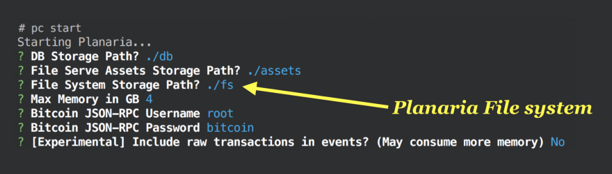
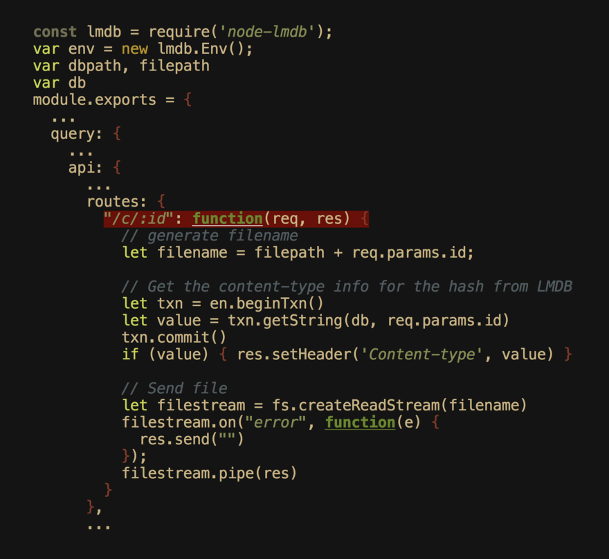
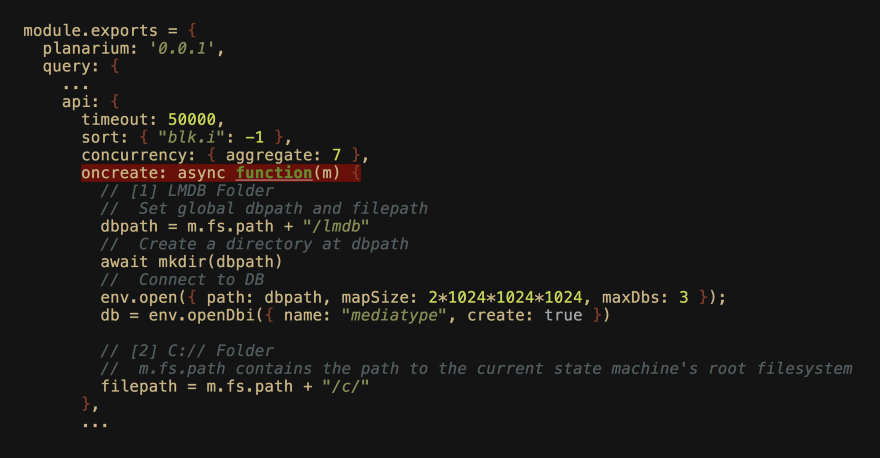

# Planaria

planaria 是 unwriter 编写的一个与 bsv 区块链进行交互的工具.

因为它是由 BSV 驱动的，所以它具有我们在传统的集中式云服务中从未见过的各种独特特征：

- 透明：因为所有数据都是以透明方式从 BSV 派生的，所以您可以确保生成的机器按设计运行。此外，任何人都可以通过 Pull 和运行节点来验证结果，只需几个简单的命令。
- 便携：所有planaria机器都是 docker 化的，可以作为单个便携式Node.js模块发布，这意味着其他任何人都可以获取已发布的代码并运行与您完全相同的状态机。
- 可共享：一个组织垄断整个后端没有任何价值，因为所有内容都源自透明存储在比特币上的公共数据和公共算法。后端可以并且将比原始创建者存在更久。
- 可定制：您可以自定义 Planaria 的数量, 没有限制。您甚至可以将它与外部事件生成器和API混合，以构建由比特币驱动的新型后端。
- 用户友好：不像大多数难懂技术让你通过繁杂的环节来实现“去中心化”，Planaria让你与比特币交互，就像它只是一个带有HTTP API的常规CRUD数据库一样。

它还附带了一个名为 Planaria Computer 的命令行界面工具，能让你通过几个命令来启动和生成这些后端，这使得使用起来更加容易。

# 使用场景

## 区块链浏览器
比特币已经存在了十年，但我们有很少的“资源管理器”服务，让人们了解区块链。这是因为这些“浏览器”的构建考虑了一个非常狭窄的用例。

Planaria将比特币视为计算机，旨在补充这一愿景。

使用Planaria，您可以构建自己的自定义“区块浏览器”，以您想要的任何方式运行。

## 公开数据库

使用Planaria，您不仅可以轻松构建这些数据库，还可以将它们转换为可货币化的公用系统，这要归功于紧密集成的比特币系统。

## 证据数据库

您可以使用Planaria派生各种数据库。您只需要编写一个程序来指导如何映射和过滤比特币。

一个很酷的用例是用于检测异常或潜在恶意事务模式的取证数据库。

## 分析数据库

您可以为应用程序使用，协议使用，事务模式使用等构建单独的独立分析数据库。此数据库可以独立于实际运行应用程序的任何人运行。

## 可修剪数据库

您可以构建一个数据库，根据特定条件自动修剪自己。见Chronos。

## 实时数据库

您可以构建一个随时间更新的数据库。

## Web应用程序后端

请记住，Planaria本质上是一个开发框架，允许您从比特币构建任何类型的状态机。

这意味着您可以重新创建任何现有的真实应用程序，但现在您使用比特币而不是使用传统的云模型。

## 长尾应用

应用程序和数据库可以尽可能地利用。

例如，您应该能够为您的家人或仅仅为邻居运行数据库，完全使用比特币。

这是可能的，因为Planaria充当“过滤器”。过滤和转换是Planaria旨在实现的目标，因此您可以构建一个过滤和转换的比特币版本，以满足特定的利基需求。

## 便携式应用

当您将应用程序存储在比特币上时，您实际上拥有一个可以在保留状态的同时进行分叉或进化的应用程序。这很简单，因为分叉应用程序所需要做的就是获取Planaria代码，进行一些修改并进行部署。然后让人们加入你的分叉。

## 这可用于实现：

- 协议升级：当整个社区迁移到新分支时，应用程序可以“升级”。
- 协议治理：让社区通过选择使用哪个分支进行投票。
- 协议专业化：构建更多来自原始应用程序的小众应用程序，这些应用程序更通用。

## 多用途后端

Planaria旨在促进数据存储的“长尾”。

更通用的数据库可以是更小众数据库的超集。

例如，Genesis是一个普通的Planaria节点，用于存储整个事务对象，是Babel的超集，Babel是一个特殊的Planaria节点，仅存储仅包含OP_RETURN输出的子集。

## 终极比特币过滤器

Planaria的主要优势在于它可以让您map和filter比特币以您想要的任何方式将其转换为具有HTTP和SSE（服务器发送事件）API的数据库。

## 映射

映射意味着您可以将比特币转换为您想要的任何格式。您可以通过这种方式构建各种有用的应用 这里有些例子：

- 审核数据库：每当您检测到某些交易模式时，您可能希望首先在存储和提供之前以“审查”（通过马赛克等）的方式对其进行转换。
- 预览数据库：您可能希望构建一个单独的数据库，用于存储原始数据的“预览”版本，您可能希望通过该数据获利。“预览数据库”将是公开可用的，但原始内容可以加密存储。
- 压缩数据库：您可以在存储之前应用某些压缩算法，而不是存储原始内容。
- 内容可寻址存储：对于某些内容，您可能希望对它们进行哈希以创建校验和，并存储校验和。这样您就可以实现内容可寻址存储。

## 过滤

Planaria节点提供程序还可以透明地对其节点进行编程，以在其数据库中排除或包含某些类型的事务。

这包括以下示例：

- 低价值的交易：例如，从数据库中省略压力测试交易
- 专业的交易子集：另一方面，您可以创建一个非常专业的数据库，仅仅抓取所述压力测试事务。这对大多数人来说可能毫无用处，但对于那些进行压力测试的人来说可能是有用的。
- 过滤非法内容：您可以过滤比特币，过滤掉所有非法内容而不存储在数据库中（例如，儿童色情内容）。过滤算法本身可以编程为状态机并在多个应用程序之间共享。

## 比特币作为IPC（进程间通话）

您还可以将比特币纯粹用作事件来触发您在JavaScript中编写的任何应用程序。

例如，您可以编写一个程序，自动发送电子邮件或短信，或者在有特定模式的传入比特币事件时发送推文。

你可以使用Node.js构建任何东西，你可以使用比特币，通过Planaria

## 透明的私人计算

您甚至可以实施“透明的私人计算”。

仅仅因为一切都是透明的并不意味着一切都必须公开。通过各种巧妙的技巧，您可以构建一个“加密的应用程序”。这是一个例子：

1. 构建Planaria节点。
2. 在Planaria节点的代码的某些部分使用加密。
3. 公开发布代码，但仅与利益相关者共享密钥。

这种方法的好处是它充分利用了两个世界（由比特币驱动的透明计算+由加密驱动的私人计算）。

- 可审计： “日志”是透明的，因此可以在以后需要时审核整个状态转换历史记录。
- 私有：虽然日志是透明的，但由于加密，利益相关者组之外的任何人都无法看到日志中的事件意味着什么。它只能由持有解密密钥的利益相关者解释。

## ANYTHING

请记住，所有现代应用程序都只是CRUD后端API + 前端用户界面。

而Planaria允许您从比特币构建“CRUD后端API”部分。所以这意味着您可以构建任何数据库 - 因此任何比特币驱动的API - 您可以想象。

# Planaria 系统编程接口

Planaria是一个应用程序框架和网络，可让您轻松构建和部署比特币驱动的应用程序后端，并将其打开为公共实用程序，让其他开发人员在无需运行他们自己的节点的情况下, 构建无服务器的比特币应用程序（并最终产生收入。

- CRUD API： Planaria监听实时比特币交易，并根据您编写的转换代码创建自治状态机，利用比特币交易作为数据库命令，通过比特币交易创建/更新/删除自定义数据库条目。

- HTTP + SSE API：如果外部世界无法查询，则DB无意义。Planaria还提供开箱即用，基于100％开放标准的HTTP + Server Sent Events API，可用于构建任何应用程序（Web应用程序，移动应用程序，服务器端应用程序等）

今天，Planaria正在打开一个全新的编程接口层。在“应用程序编程”之上，您将能够进行“系统编程”。

你将能够在比特币上运行各种各样的东西。所有这一切现在都是可能的，因为Planaria正在开放其“系统编程接口”，让开发人员做更多底层的事情，同时充分利用Planaria完全相同的透明计算模型，其中每个比特币交易都是一个命令。这意味着所有命令及其产生的状态转换对全世界都是100％透明的，而不必将整个状态机存储在链上。

您可以基本上从比特币交易中“重现”确定状态机，而不是将整个状态机存储在链上，而只需将最少的数据存储在比特币本身上。

## 介绍Planaria系统编程接口

以前Planaria提供了一个“应用程序编程接口”，由比特币事务驱动，在内置的MongoDB实例上执行CRUD操作。虽然功能强大，但它只是一种特定类型的状态存储。我们可以走得更远。

今天，Planaria迈出了开放其“系统编程接口”的第一步。

Planaria节点开发人员现在可以访问更强大的功能，包括：

- 完全访问文件系统
- 自定义API端点，可以根据需要添加多个端点。

对于后端开发人员，这意味着您现在可以使用Planaria构建功能更强大的状态机和由比特币驱动的API端点。

对于应用程序开发人员，这意味着您很快就可以访问由上述Planaria节点开发人员构建的强大的新API端点，这些开发人员将节点发布到Planaria网络。

## 1. Planaria文件系统

最近，Planaria添加了一项名为“Planaria File Serve API”的新功能，该功能提供了即时静态文件服务器功能。基本上，它允许您写入一个名为 assets 的文件夹，并通过新的HTTP端点立即将它们作为静态文件提供。

事实证明，这个简单的功能非常强大，为像Bitstagram等有趣的应用程序提供动力。

今天我们将这个提升到了一个新的水平。

如果文件服务API为您提供了对命名的单个 assets 文件夹的有限访问权限，则新的Planaria文件系统界面允许您访问整个文件系统，其中Planaria（用于写入）和Planarium（用于读取）操作。



1. 整个文件系统：除了作为Planaria主干的内置MongoDB实例外，您还可以通过写入和读取文件来实现其他状态存储。

2. 灵活：与文件服务API不同，文件服务API仅限于一个名为assets的文件夹，默认情况下是公共的，默认情况下，新文件系统接口是私有的，就像常规后端的工作方式一样。这意味着您可以构建一个透明的后端，而无需公开所有内容。

3. 构建自己的文件服务API：灵活性允许各种模型的后端隐私模型。对于初学者，新文件系统接口可用于构建任意数量的文件服务api。而且它更强大，因为您可以编写自己的自定义文件服务处理程序（旧文件服务API很简单但不可自定义）。

4. 专用文件系统：通常您不希望您的文件可以立即被公共HTTP访问访问。例如，您可能正在存储私钥。您可能正在存储不应向公众公开的第三方API密钥。（类似于程序员永远不会将环境变量提交给像git这样的版本控制系统）或者你可能正在存储一个基于文件的数据库，它作为一个文件blob存在，并且意味着通过数据库查询接口访问而不是访问原始文件本身。等等。通过提供私有文件​​系统，您可以构建极其灵活的应用程序，仍然可以充分利用比特币的透明度（因为所有“命令”和“事件”都是比特币交易）

## 2. Planarium自定义端点

到目前为止，每个Planaria微服务都有两个强大的内置API端点：

- Bitquery：一个HTTP端点（位于/q），用于使用以JSON编写的图灵完整可移植查询语言（也称为“Bitquery”）查询区块链。

- Bitsocket：用于可编程推送通知API（位于/s）的服务器发送事件端点，它允许您使用相同的Bitquery查询语言侦听非常特定的比特币交易模式。

由于Bitquery查询语言具有表现力，开发人员已经能够使用这两个API对比特币区块链进行各种强大的查询。

现在有了文件系统支持，您可能希望添加其他端点来为您的文件提供服务，甚至可以通过其他方式将其他数据添加到您的Planaria状态机中。

从今天开始，您可以添加自己的自定义GET HTTP端点到 planarium.js

> 注意：只允许GET请求，因为只有比特币可以写入Planaria。如果要写入Planaria，则不要向Planaria节点本身发出POST或PUT请求。相反，你通过比特币交易“发布”。

这就是它的样子:



在内部，Planarium API端点由express.js提供支持，并且路由直接映射到express.js的本机GET处理程序。

在这个例子中，我们定义了一个GET /c/:id端点，它将自动映射到以下URL：

```
HTTPS：// [HOST_PATH] / [PLANARIA_MACHINE_ADDRESS] / C / [ID]
```

> 注意：您可以根据需要添加任意数量的路径处理程序！

以下是实际示例：

```
HTTPS：//data.bitdb.network/1KuUr2pSJDao97XM8Jsq8zwLS6W1WtFfLg/c / ....
```

所有Planaria端点URL都以其机器地址为前缀。每台机器由其比特币地址（而不是其主机HTTP URL）唯一标识。这就是Planaria如何确保应用程序的可移植性。

因为机器是由比特币地址而不是主机的HTTP URL标识的，所以所有Planaria状态机都独立于它们所服务的主机，并且独立于基于服务器客户机的HTTP方案。它是比特币原生的。

当由另一台主机运行时，同一台机器看起来像这样，例如：

```
HTTPS：//files.bitdb.network/1KuUr2pSJDao97XM8Jsq8zwLS6W1WtFfLg/c / ....
```

它们与另一个端点完全相同，因为它们是由相同的代码构成的。

## 3.初始化程序

利用Planaria可以做的所有这些新事物，您将立即意识到需要一些方法来初始化您将在整个机器生命周期中使用的各种模块。例如，您可能想要：

- 首次设置Planaria计算机时，初始化一次基于文件的数据库。
- 创建将在整个机器生命周期的其余部分使用的空文件夹。
- 初始化将在整个机器生命周期中使用的某些库。
- 将现有的AI模型导入一次作为“起源”心智模型。

为此，Planaria添加了一个名为的新事件处理程序oncreate。oncreate初始化机器时，该事件将被完全触发一次。

当然，由于有两个容器，我们有两个oncreate初始化器：

- planaria.js：位于oncreate。Planaria容器用于写入状态，因此当机器第一次运行时，它会被执行一次。
- planarium.js：位于query.api.oncreate。Planarium略有不同。Planarium容器仅供阅读，无写入功能。因此，每次创建容器时，Planarium 都会被执行。

这是一个planarium.js 示例设置（query.api.oncreate）




## 实际例子

让我们看看所有这些功能如何通过一个真实世界的例子汇集在一起​​：`C://`，一个基于比特币的内容可寻址文件系统。

`C://` 通过SHA256生成文件名, 给比特币上传的内容，并将内容哈希下的文件内容以该文件名存储。这意味着每个唯一内容只有一个通用文件名，它引入了有趣的属性，使我们可以将这些文件用作确定性应用程序的构建块。

在我们进入之前，您可以找到运行的整个代码和公共节点：

https://planaria.network/@1KuUr2pSJDao97XM8Jsq8zwLS6W1WtFfLg

1.初始化器

对于这台机器，我们使用新引入的事件处理程序oncreate。

对于Planaria，当机器首次启动时，它会被执行一次。它仅在第一次运行机器时运行，之后onrestart在节点重新启动时调用。

因为我们只希望在开始执行 mkdir 一次，这属于 planaria.js 内部oncreate的。

```js
module.exports = {
  ...
  oncreate: async function(m) {
    // create C:// folder
    await mkdir(m.fs.path + "/c")
    // create LMDB folder
    await mkdir(m.fs.path + "/lmdb")
    // Initialize LMDB
    en.open({
      path: fspath + "/lmdb",
      mapSize: 2*1024*1024*1024,
      maxDbs: 3
    });
    db = en.openDbi({ name: "mediatype", create: true })
  },
  ...
}
```


# 使用 pc

可以通过 `pc` planaria computer, 一个命令行的远程工具, 来连接到远程的 planaria 节点.

1. 安装 pc:  `npm install -g planaria`
2. 生成新用户(秘钥对): `pc new user`
3. 连接到远程 planaria 节点

# 部署

运行 planaria 节点需要至少 2GB 内存和 200GB 硬盘.


# BitcoinSV 节点

首先, 需要运行 BitcoinSV 节点. 而且需要对 `bitcoin.conf` 做如下配置:

```
# 存放区块数据的路径
datadir=/Bitcoin
# 设置数据库缓存的大小(MB)
dbcache=4000
# 必须是 txindex=1 ,这样 Bitcoind 才会保存所有的索引
txindex=1

# [rpc]
# 接受命令行和 JSON-RPC 的请求
server=1
# 默认的 JSON-RPC 的用户名和密码
# Planaria 使用以下默认设置
# 可以在执行 'pc start' 时修改
rpcuser=root
rpcpassword=bitcoin

# 是否允许远程 rpc 请求
rpcallowip=0.0.0.0/0
# [wallet] 关闭 wallet 功能
disablewallet=1

# [ZeroMQ]
# ZeroMQ 支持了 planaria 的数据实时抓取功能
# 所以这里的设置很重要
zmqpubhashtx=tcp://[YOUR SERVER IP]:28332
zmqpubhashblock=tcp://[YOUR SERVER IP]:28332

# rpc 请求队列的长度
rpcworkqueue=512

# Support large mempool
maxmempool=6000

# Support large pushdata
datacarriersize=100000

# Long mempool chain support
limitancestorsize=100000
limitdescendantsize=100000
```

使用 https://github.com/kevinejohn/docker-bitcoinsv 提供的 dockerfile 即可快速部署 bitcoinsv 的节点.

1. 在 DaoCloud 上创建新项目, 命名为 bitcoinsv, github 仓库地址填写上面的地址, 手动触发构建任务.
2. 构建成功后, 我们就获得了 image: `daocloud.io/quantum_leap/bitcoinsv` .

在 DaoCloud 的stack界面, 新建 bitcoinsv stack, yaml 文件可以这样写:

```yaml
version: "2"
services:
  bitcoinsv:
    image: daocloud.io/quantum_leap/bitcoinsv:master
    environment:
      IFS: ""
      BITCOIN_CONF: |
        # location to store blockchain and other data.
        datadir=/Bitcoin
        dbcache=4000
        # Must set txindex=1 so Bitcoin keeps the full index
        txindex=1

        # [rpc]
        # Accept command line and JSON-RPC commands.
        server=1
        # Default Username and Password for JSON-RPC connections
        # Planaria uses these values by default, but if you can change the settings
        # When you run 'pc start'
        rpcuser=root
        rpcpassword=bitcoin

        # If you want to allow remote JSON-RPC access
        rpcallowip=0.0.0.0/0
        # [wallet]
        disablewallet=1

        # [ZeroMQ]
        # ZeroMQ messages power the realtime Planaria crawler
        # so it's important to set the endpoint
        zmqpubhashtx=tcp://0.0.0.0:28332
        zmqpubhashblock=tcp://0.0.0.0:28332

        # Planaria makes heavy use of JSON-RPC so it's set to a higher number
        # But you can tweak this number as you want
        rpcworkqueue=512

        # Support large mempool
        maxmempool=6000

        # Support large pushdata
        datacarriersize=100000

        # Long mempool chain support
        limitancestorsize=100000
        limitdescendantsize=100000
    command:
      [sh, -c, "mkdir -p /Bitcoin && echo $$BITCOIN_CONF > /Bitcoin/bitcoin.conf && bitcoind -conf=/Bitcoin/bitcoin.conf"]
    ports:
    - 8333:8333
    - 8332:8332
    volumes:
    - /mnt/Bitcoin:/Bitcoin
```


#### Trouble Shooting

- 尽管硬盘空间充足, 依旧提示 `Error: Error: Disk space is low!`, 并且自动退出.

数据没有正确存放到硬盘的挂载路径里.


### planaria

https://github.com/interplanaria 上提供了 planaria 的 dockerfile, 使用 docker 可以轻松部署 planaria 到我们的主机上.

planaria 的 dockerfile 内容如下:

```dockerfile
FROM mongo:latest
RUN apt-get update && \
    apt-get install -y wget unzip htop && \
    apt-get install -y sudo && \
    apt-get install -y curl && \
    apt-get install -y netcat && \
    curl -sL https://deb.nodesource.com/setup_10.x | bash - && \
    apt-get install -y nodejs \
    libtool pkg-config build-essential autoconf automake uuid-dev
RUN wget -q https://github.com/zeromq/libzmq/releases/download/v4.2.2/zeromq-4.2.2.tar.gz
RUN tar -xzvf zeromq-4.2.2.tar.gz
WORKDIR /zeromq-4.2.2
RUN ./configure
RUN make install & ldconfig

COPY . /planaria
RUN cd /planaria && rm -rf node_modules && npm install

VOLUME /data/db
VOLUME /planaria/.state

WORKDIR /planaria

EXPOSE 28332
EXPOSE 28339
EXPOSE 28337

ENTRYPOINT ["/planaria/entrypoint.sh"]
```

可以看出其中包含了 MongoDB, ZeroMQ 等工具. 并且开放了 28332, 28339, 28337 端口.

部署流程如下:

1. 在 DaoCloud 上创建新项目, 命名为 planaria, github 仓库地址填写 https://github.com/interplanaria/planaria.git, 手动触发构建任务.
2. 构建成功后, 我们就获得了 image: `daocloud.io/quantum_leap/planaria` . 切换到"应用"界面, 选择planaria 右边的 "部署最新版本"
3. 部署成功后, 需要设置启动命令.

查看 planaria 内置的 entrypoint 脚本:

```sh
#!/bin/bash

set -e
if [[ "$1" == "start" ]]; then

  echo "# Starting Mongodb......."
  echo "arg0: $2"
  echo "arg1: $3"
  echo "arg2: $4"
  echo "arg3: $5"
  mongod --bind_ip_all --wiredTigerCacheSizeGB=$2 &
  until nc -z localhost 27017
    do
      sleep 1
    done

  echo "# Inheriting package.json...."
  node /planaria/merge /planaria
  echo "# rm -rf node_modules..."
  rm -rf ./node_modules
  echo "# npm install..."
  npm install

  echo "# Starting Planaria......."
  node --max-old-space-size=4096 /planaria/index $3 $4 $5
fi

exec "$@"
```

可以看出它需要读取 5 个参数.